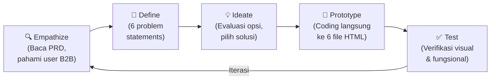

# Korelasi Design Thinking dalam Update UI/UX Website UD NIMARS

Berikut adalah penjelasan bagaimana setiap tahapan **Design Thinking** diterapkan secara nyata dalam proses update UI/UX yang telah kita kerjakan bersama.

---

## Tahap 1: Empathize (Memahami Pengguna)

**Definisi:** Memahami kebutuhan, masalah, dan konteks pengguna secara mendalam.

**Apa yang dilakukan:**
- Membaca dan menganalisis **PRD (Product Requirements Document)** baru yang berisi umpan balik dan kebutuhan klien B2B (HORECA).
- Mengidentifikasi **pain points** pengguna target, yaitu:
  - Klien korporat butuh **akses cepat ke komunikasi** (WhatsApp) tanpa harus mencari halaman kontak.
  - Klien butuh **bukti kredibilitas** sebelum memutuskan kerjasama (logo mitra, sertifikasi).
  - Procurement manager butuh **simulasi harga** sebelum mengajukan RFQ ke manajemen.
  - Informasi **metode pembayaran** (Tempo/Transfer) adalah faktor krusial dalam keputusan B2B.

**Korelasi dengan fitur:**

| Pain Point Pengguna | Fitur yang Lahir |
|---|---|
| "Saya ingin langsung chat tanpa repot" | Floating WhatsApp Button |
| "Apakah perusahaan ini bisa dipercaya?" | Logo Mitra & Badge Sertifikasi |
| "Berapa diskon jika saya pesan banyak?" | Kalkulator Estimasi Volume |
| "Apakah bisa bayar tempo?" | Info Pembayaran di Footer |

> [!IMPORTANT]
> Tahap ini adalah fondasi. Tanpa memahami bahwa pengguna utama adalah **procurement manager HORECA** (bukan konsumen retail), solusi yang dibangun bisa salah sasaran.

---

## Tahap 2: Define (Mendefinisikan Masalah)

**Definisi:** Menyaring insight dari tahap Empathize menjadi pernyataan masalah yang jelas dan dapat ditindaklanjuti.

**Apa yang dilakukan:**
- Dari PRD baru, kami merumuskan **6 problem statement** spesifik:

```
1. Website belum memiliki identitas visual di tab browser (tidak ada favicon).
2. Tidak ada jalur komunikasi instan yang persisten di seluruh halaman.
3. Tidak ada social proof berupa portofolio klien yang terlihat.
4. Sertifikasi keamanan pangan belum ditampilkan secara visual.
5. Klien tidak bisa melakukan estimasi harga mandiri sebelum mengirim RFQ.
6. Footer tidak informatif — kurang data pembayaran, FAQ, dan jam operasional.
```

- Masalah-masalah ini kemudian diprioritaskan berdasarkan **dampak terhadap konversi lead B2B**.

**Hasil tahap ini:**
- Dokumen [implementation_plan.md](file:///C:/Users/Puraka/.gemini/antigravity/brain/e7fc236f-3580-499e-b84d-14524b43e033/implementation_plan.md) yang berisi rencana teknis terstruktur untuk 6 poin perbaikan.

> [!NOTE]
> Perbedaan antara Empathize dan Define: Empathize = "Klien merasa ragu bekerjasama." Define = "Tidak ada badge sertifikasi HACCP/ISO yang terlihat di halaman, sehingga kredibilitas tidak tersampaikan."

---

## Tahap 3: Ideate (Menghasilkan Solusi)

**Definisi:** Brainstorming berbagai solusi kreatif untuk setiap masalah yang telah didefinisikan.

**Apa yang dilakukan:**
- Untuk setiap problem statement, kami mengevaluasi beberapa opsi solusi:

### Contoh proses ideasi:

**Masalah: "Tidak ada jalur komunikasi instan"**
| Opsi | Evaluasi | Keputusan |
|---|---|---|
| Live chat widget (Tawk.to, Crisp) | Butuh integrasi pihak ketiga, berat | ❌ Ditolak |
| Chatbot AI | Overkill untuk skala saat ini | ❌ Ditolak |
| **Floating WhatsApp Button** | Ringan, familiar bagi user Indonesia, zero dependency | ✅ **Dipilih** |
| Link WA di header saja | Tidak persisten saat scroll | ❌ Ditolak |

**Masalah: "Klien tidak bisa estimasi harga mandiri"**
| Opsi | Evaluasi | Keputusan |
|---|---|---|
| Tabel harga statis | Membuka harga ke kompetitor | ❌ Ditolak |
| Form kalkulator penuh (input harga per item) | Terlalu kompleks, data harga sensitif | ❌ Ditolak |
| **Slider tier diskon volume** | Informatif tanpa buka harga aktual, interaktif | ✅ **Dipilih** |

**Keputusan desain lainnya:**
- **Sertifikasi** → Menggunakan icon cards (bukan gambar scan sertifikat) agar tetap clean dan profesional.
- **Logo mitra** → Menggunakan marquee scroll (bukan grid statis) untuk kesan dinamis dan menghemat ruang.
- **Footer** → Layout diperluas dari 4 kolom menjadi 5 kolom (dengan brand column `col-span-2`) untuk menampung info pembayaran.

---

## Tahap 4: Prototype (Membangun Prototipe)

**Definisi:** Membuat versi nyata dari solusi yang telah dipilih untuk bisa diuji.

**Apa yang dilakukan:**
- Langsung mengimplementasikan ke kode HTML/CSS/JS karena arsitektur proyek ini adalah **static MPA** (Multi-Page Application) tanpa framework, sehingga prototyping = coding langsung.

**Detail implementasi per fitur:**

### 4.1 Custom Favicon
```
File dibuat: assets/favicon.svg
Dipasang di: 6 halaman (<link rel="icon">)
```

### 4.2 Floating WhatsApp Button
```
CSS: .wa-float (fixed position, z-index 90, hover animation + tooltip)
HTML: <a> tag dengan SVG icon WhatsApp, pre-filled message
Dipasang di: 6 halaman (sebelum </body>)
```

### 4.3 Logo Mitra Bisnis
```
CSS: @keyframes logoScroll (infinite marquee)
HTML: Section baru setelah hero/trust-bar di index.html
Konten: 6 nama klien × 2 (duplikat untuk seamless loop)
```

### 4.4 Badge Sertifikasi
```
HTML: Grid 2×2 (mobile) / 4×1 (desktop) dengan Lucide icons
Lokasi: index.html (setelah client logos, sebelum value proposition)
Icons: shield (HACCP), award (ISO), leaf (GAP), check-circle-2 (Audited)
```

### 4.5 Kalkulator Volume
```
HTML: Range slider (50-5000 Kg) + 3 tier cards
CSS: Custom slider thumb, .tier-badge.active state
JS: updateCalc() — dynamic gradient fill + tier highlighting
Lokasi: quote.html (setelah form RFQ, sebelum footer)
```

### 4.6 Enhanced Footer
```
Layout: 5 kolom (brand col-span-2 + 3 kolom navigasi)
Tambahan: Metode Pembayaran badges, link FAQ, jam operasional, Privacy/ToS
Diterapkan di: 6 halaman (konsisten)
```

> [!TIP]
> Karena ini static MPA tanpa templating engine, setiap perubahan footer harus dilakukan manual di 6 file. Pada proyek yang lebih besar, ini akan menjadi argumen kuat untuk migrasi ke component-based architecture.

---

## Tahap 5: Test (Menguji & Validasi)

**Definisi:** Menguji prototipe dengan pengguna nyata atau simulasi untuk mendapatkan umpan balik.

**Apa yang dilakukan:**
- Menyiapkan **task tracker** ([task.md](file:///C:/Users/Puraka/.gemini/antigravity/brain/e7fc236f-3580-499e-b84d-14524b43e033/task.md)) untuk memastikan semua 6 poin terimplementasi.
- Verifikasi **konsistensi antar halaman** — memastikan favicon, WA button, dan footer identik di semua 6 file.

**Metode testing yang direkomendasikan:**

| Aspek | Cara Uji |
|---|---|
| Favicon | Buka setiap halaman di browser, cek tab icon |
| WhatsApp Button | Klik tombol hijau → pastikan buka wa.me dengan pesan pre-filled |
| Logo Marquee | Buka index.html, pastikan scroll berjalan smooth & pause on hover |
| Sertifikasi | Visual check grid layout di desktop & mobile (responsive) |
| Kalkulator | Geser slider di quote.html → pastikan tier highlight berubah real-time |
| Footer | Scroll ke bawah di semua 6 halaman → cek konsistensi konten |

> [!WARNING]
> Tahap Test ini **belum sepenuhnya dilakukan** karena server lokal belum dijalankan. Disarankan untuk membuka file di browser dan melakukan pengecekan manual sesuai tabel di atas.

---

## Ringkasan Alur Design Thinking → Implementasi



**Kunci utama:** Design Thinking bukan proses linear — ini **iteratif**. Jika pada tahap Test ditemukan masalah (misal: kalkulator kurang intuitif), kita kembali ke Ideate untuk mencari solusi alternatif, lalu Prototype ulang.
